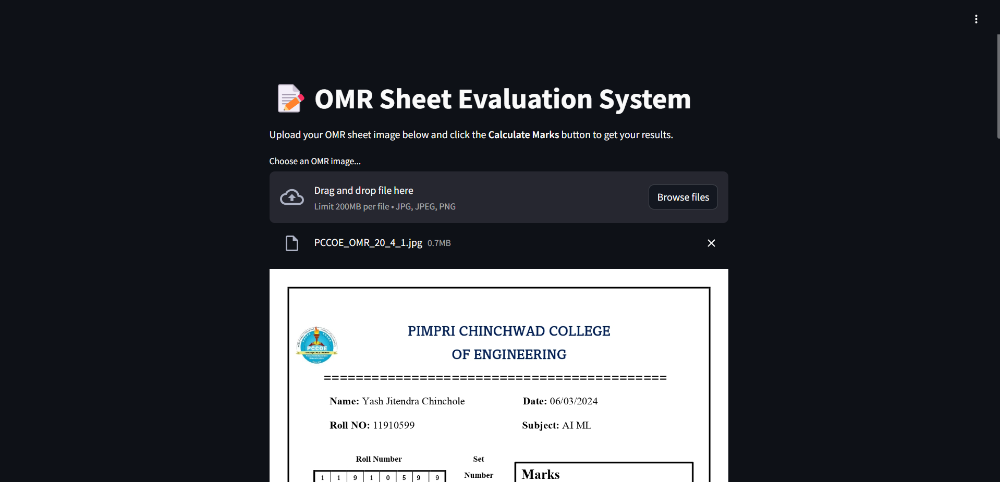
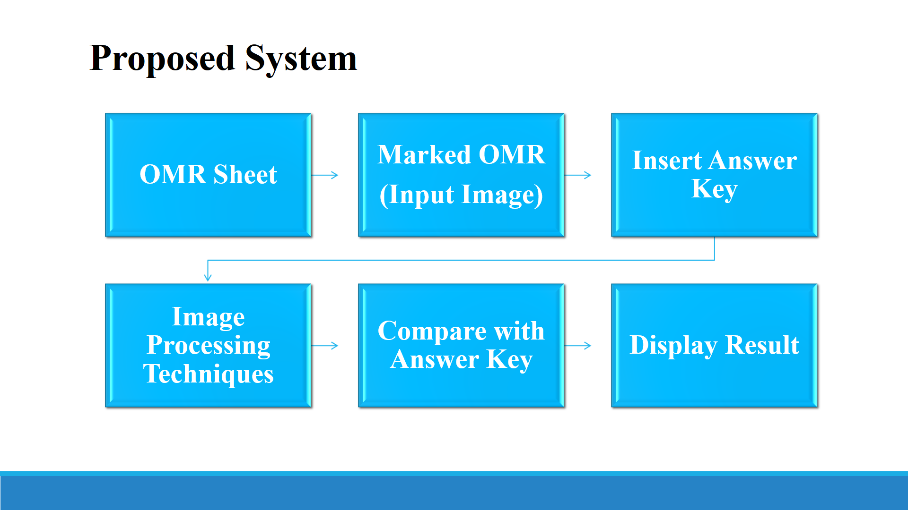
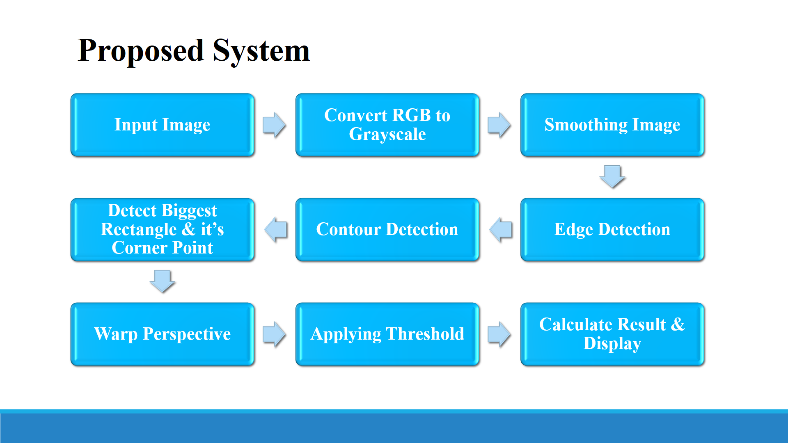
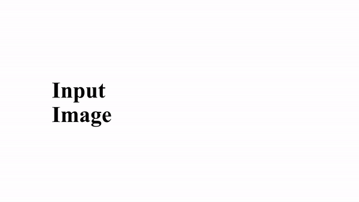

# OMR Sheet Evaluation System

## Description

OMR (Optical Mark Recognition) sheets are widely used in educational and survey sectors for data collection. Traditionally, the process of evaluating OMR sheets manually is tedious, time-consuming, and prone to human errors. This project aims to automate the evaluation process using image processing techniques, providing a cost-effective solution compared to expensive OMR scanning machines.

The algorithm evaluates the responses, displays grades and percentages on the input image, and highlights correctly marked options in green, wrongly marked options in red, and the actual answers in yellow.

## Live Website

Check out the live version of the project [here](https://omr-sheet-evaluation-system.onrender.com/).

### Screenshot of Website

Here’s a glimpse of the website:

## Repository Link

Explore the codebase on GitHub: [OMR Sheet Evaluation System](https://github.com/yashchinchole/OMR-Sheet-Evaluation-System)

## Features and Key Points

- **Automated Evaluation**: Eliminates the need for manual checking, reducing human errors.
- **Cost-effective**: Provides a budget-friendly alternative to expensive OMR scanning machines.
- **Quick Results**: Processes and evaluates response sheets within seconds.
- **Visual Feedback**: Displays correctly marked options in green, wrongly marked options in red, and actual answers in yellow.
- **Detailed Output**: Shows marks obtained, percentage, and grade directly on the input image.

## Proposed Methodology

### 1. Convert RGB Image to Gray Scale

OMR sheets come in various colors, so the first step is to transform them into a uniform color for further processing. This is achieved by converting the RGB image to a grayscale image.

### 2. Image Smoothing/Image Blur

To reduce noise, a Gaussian filter is applied, lowering the high-frequency components.

### 3. Detecting Edges

Edges in the image are detected using the Canny Edge Detection algorithm.

### 4. Contour Detection

Rectangular contours are detected and sorted in decreasing order to identify the largest rectangles, which represent the marked options on the OMR sheets. The corner points of these rectangles are marked.

### 5. Warp Perspective: Birds Eye View Format

To detect the marked bubbles for each question, the non-pixel value of each bubble is obtained. The highest non-pixel value for each question is considered as the marked bubble. These indices are then compared to the actual answer key, and the results are displayed on the input image.

## Technologies Used

- Python
- OpenCV
- NumPy
- Streamlit

## Sample Example

